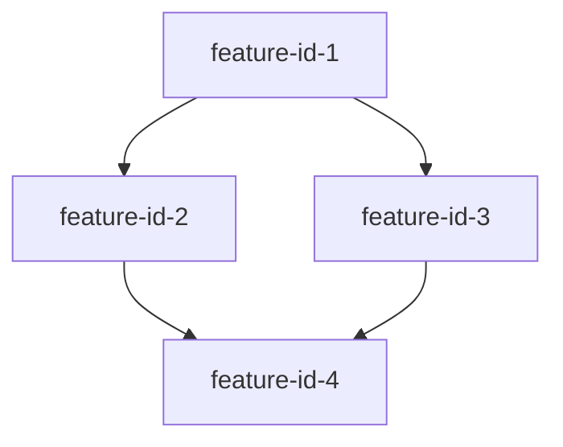

# Implementation Plan: Blueprint

**Spec**: [Blueprint spec](./spec.md)

---

## Summary

The blueprint feature defines the complete product roadmap by analyzing the product vision and breaking it down into 16 discrete, implementable features with clear dependencies and priorities. This implementation populates `.xe/specs/blueprint/spec.md` with the feature catalog, dependency graph, complexity estimates, and implementation approach—serving as the architectural north star for all subsequent feature development. The blueprint enables systematic product delivery by identifying which features can be built in parallel and which must be completed sequentially.

**Design rationale**: See [research.md](./research.md) for detailed feature breakdown analysis, dependency tier structure, and architectural alignment decisions.

---

## Technical Context

This feature implementation plan extends the technical architecture defined in [.xe/architecture.md](../../architecture.md).

**Feature-specific technical details:**

- **Primary Components**: Blueprint specification document (spec.md) containing feature catalog and dependency graph
- **Data Structures**: Feature metadata (ID, dependencies, complexity, priority, scope), dependency graph (mermaid format)
- **Dependencies**: Product vision (.xe/product.md), architecture guidelines (.xe/architecture.md), engineering principles (.xe/engineering.md)
- **Configuration**: None (this feature produces specification only)
- **Performance Goals**: N/A (documentation feature)
- **Testing Framework**: Manual validation of spec completeness and dependency graph correctness
- **Key Constraints**: Dependency graph MUST be acyclic, all features MUST have unique IDs

---

## Project Structure

```
.xe/specs/blueprint/
├── spec.md        # Feature catalog with dependency graph (created by this feature)
├── plan.md        # This implementation plan
├── tasks.md       # Implementation task breakdown
└── research.md    # Product analysis and feature breakdown rationale
```

---

## Data Model

**Entities owned by this feature:**

- **Feature**: Discrete product capability with clear scope and implementation requirements
  - `id`: string (kebab-case unique identifier)
  - `title`: string (friendly display name)
  - `dependencies`: array of feature IDs this depends on
  - `complexity`: 'Small' | 'Medium' | 'Large' (time estimate category)
  - `priority`: number (implementation order)
  - `scope`: string (1-2 sentence description)
  - `tier`: number (dependency tier 0-4, derived from dependencies)

- **Dependency Graph**: Visual representation of feature relationships
  - Format: Mermaid diagram embedded in markdown
  - Nodes: Feature IDs
  - Edges: Dependency relationships (A → B means B depends on A)
  - Constraint: MUST be acyclic (no circular dependencies)

- **Implementation Approach**: Recommended rollout strategy
  - Feature implementation order
  - Parallelization opportunities
  - Timeline estimates

**Entities from other features:**

- **Product Vision**: High-level product description (.xe/product.md)
- **Architecture Guidelines**: Technical constraints and patterns (.xe/architecture.md)
- **Engineering Principles**: Code quality standards (.xe/engineering.md)

---

## Contracts

### Blueprint Specification Document

**Location:** `.xe/specs/blueprint/spec.md`

**Purpose:** Canonical definition of all product features with dependencies, priorities, and scope

**Structure:**

```markdown
# Blueprint: {product-name}

## Description
[Product overview and blueprint purpose]

## Core Entities
[Key data structures and concepts across all features]

## Feature Dependency Graph
[Mermaid diagram showing feature relationships]

## Features

### Tier {N}: {Tier Name}

#### Feature {N}: {feature-name}
**ID**: `{feature-id}`
**Dependencies**: [{list-of-feature-ids}]
**Complexity**: {Small|Medium|Large}
**Priority**: {number}

**Scope**: {1-2 sentence description}

**Deliverables**:
- {Specific output 1}
- {Specific output 2}

[Additional detail as needed]

## Success Criteria
[Measurable conditions for blueprint completeness]

## Implementation Approach
[Recommended feature implementation order and timeline]
```

**Validation Rules:**

- All features have unique IDs (kebab-case)
- All features have dependencies list (empty array if none)
- All features have complexity estimate
- All features have priority number
- All features have scope description
- Dependency graph is present and acyclic
- Dependency graph includes all feature IDs
- Features are organized into numbered tiers

---

## Implementation Approach

### 1. Data Structures

**Feature Metadata Format:**

Each feature in the spec follows this structure:

```markdown
#### Feature {priority}: {feature-name}
**ID**: `{feature-id}`
**Dependencies**: [{dep1}, {dep2}]
**Complexity**: {Small|Medium|Large}
**Priority**: {number}

**Scope**: {description}

**Deliverables**:
- {item 1}
- {item 2}
```

**Dependency Graph Format (Mermaid):**



### 2. Core Algorithm

**Blueprint Generation Process:**

1. **Analyze Product Vision**:
   - Read `.xe/product.md` for system overview and goals
   - Read `.xe/architecture.md` for technical constraints
   - Read blueprint description for detailed requirements
   - Identify core user journeys and key capabilities

2. **Identify Core Entities**:
   - Extract domain concepts that span multiple features
   - Define entities that represent product fundamentals
   - Document entity purposes (not full schemas)

3. **Feature Decomposition**:
   - Break product into discrete, implementable features
   - Apply SOLID principles (single responsibility, separation of concerns)
   - Ensure features are independently testable
   - Keep feature scope to 1-2 sentence descriptions
   - Avoid features that are too granular or too broad

4. **Dependency Analysis**:
   - For each feature, identify prerequisite features
   - Ensure no circular dependencies
   - Assign features to dependency tiers (0-based)
   - Tier N = all dependencies are in tiers 0 to N-1

5. **Complexity Estimation**:
   - Small: 1-3 days (simple files, basic logic, minimal integration)
   - Medium: 4-7 days (content creation, moderate complexity, some integration)
   - Large: 8+ days (complex logic, multiple integrations, significant automation)

6. **Prioritization**:
   - Number features in implementation order
   - Within same tier, order by business value and risk
   - Foundation features come before dependent features

7. **Generate Dependency Graph**:
   - Create mermaid diagram with all features
   - Add edges for all dependency relationships
   - Validate graph is acyclic (use topological sort)
   - Organize visually by tiers (top to bottom)

8. **Document Success Criteria**:
   - All features documented with required fields
   - Dependency graph present and acyclic
   - Features properly scoped and prioritized

9. **Define Implementation Approach**:
   - Recommend feature implementation order
   - Identify parallelization opportunities
   - Estimate timeline based on complexity

### 3. Integration Points

**Consumed by:**

- `start-rollout` playbook: Reads blueprint spec for feature context when implementing individual features
- Product managers: Use blueprint for roadmap planning and prioritization
- Engineers: Reference blueprint to understand feature relationships and implementation order

**Depends on:**

- `.xe/product.md`: Product vision and goals
- `.xe/architecture.md`: Technical constraints and patterns
- `.xe/engineering.md`: Code quality and design principles
- `.xe/process/development.md`: Development workflow and phases

### 4. Error Handling

**Missing Context:**
- If `.xe/product.md` missing: Halt and notify user (required dependency)
- If `.xe/architecture.md` missing: Proceed with general best practices, note limitation
- If blueprint description insufficient: Ask clarifying questions per playbook

**Validation Failures:**
- Circular dependencies detected: Identify cycle, suggest restructuring
- Duplicate feature IDs: Report conflict, require unique IDs
- Missing required fields: Report which features incomplete
- Invalid complexity values: Report features with invalid complexity, require correction

**Scope Issues:**
- Features too granular: Suggest combining related features
- Features too broad: Suggest splitting into sub-features
- Unclear dependencies: Request clarification on feature relationships

### 5. Performance Considerations

Not applicable - this is a documentation/specification feature with no runtime performance requirements.

**Optimization for AI processing:**
- Keep feature descriptions concise (1-2 sentences)
- Use consistent formatting for easier parsing
- Use mermaid for dependency graph (widely supported)
- Use kebab-case IDs (easy to reference, URL-safe)

### 6. Testing Strategy

**Manual Validation:**

- Verify all 16 features documented
- Verify each feature has all required fields (ID, dependencies, complexity, priority, scope)
- Verify dependency graph is acyclic (no circular dependencies)
- Verify features are organized into correct tiers based on dependencies
- Verify implementation order is logical and respects dependencies
- Verify spec aligns with product vision in `.xe/product.md`

**Specification Completeness:**

- All product capabilities from blueprint description are covered by features
- No critical features missing from breakdown
- Feature scopes are clear and unambiguous
- Dependencies accurately reflect feature relationships

**Quality Checks:**

- Feature IDs follow kebab-case convention
- Complexity estimates are reasonable
- Priority numbers are sequential and correct
- Success criteria are measurable and complete

---

## Usage Examples

**Reading the blueprint during feature implementation:**

```bash
# When implementing a specific feature, read blueprint for context
/catalyst:run start-rollout init-script

# AI will read .xe/specs/blueprint/spec.md to understand:
# - Feature scope and deliverables
# - Feature dependencies (what must be built first)
# - Feature complexity (time estimate)
# - How this feature fits into overall product
```

**Using the dependency graph for planning:**

Product managers can review the dependency graph to:
- Identify which features can be built in parallel
- Understand which features block others
- Plan sprint capacity based on complexity estimates
- Visualize product build sequence

**Tracking implementation progress:**

```markdown
# In .xe/rollouts/rollout-blueprint.md

## Feature Status

### Tier 0 (Foundation)
- [x] repository-structure (complete)
- [x] init-issue-template (complete)
- [ ] agreement-guide (in progress)

### Tier 1 (Core Configuration)
- [ ] settings-schema (not started)
- [ ] init-script (not started)
- [ ] snippet-library (not started)
```

**Querying features by dependency tier:**

Engineers can identify parallelization opportunities:
- Tier 0 features can be built in any order (no dependencies)
- Tier 1 features can be built in parallel once Tier 0 complete
- Tier 2 features depend on Tier 1, etc.
