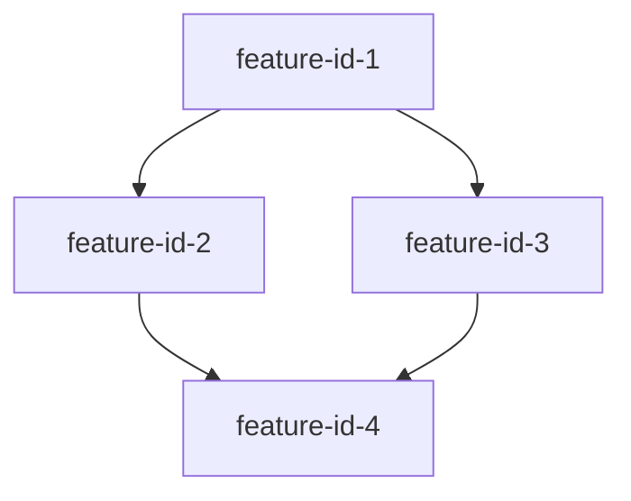

# Implementation Plan: Blueprint

**Spec**: [Blueprint spec](./spec.md)

---

## Summary

The blueprint feature defines the complete product roadmap by analyzing the product vision and breaking it down into discrete, implementable features with clear dependencies and priorities. This implementation populates `.xe/specs/blueprint/spec.md` with the feature catalog, dependency graph, complexity estimates, and implementation approach—serving as the architectural north star for all subsequent feature development. The blueprint enables systematic product delivery by identifying which features can be built in parallel and which must be completed sequentially.

**Design rationale**: See [research.md](./research.md) for detailed feature breakdown analysis, dependency tier structure, and architectural alignment decisions.

---

## Technical Context

This feature implementation plan extends the technical architecture defined in [.xe/architecture.md](../../architecture.md).

**Feature-specific technical details:**

- **Primary Components**: Blueprint specification document (spec.md) containing feature catalog and dependency graph
- **Data Structures**: Feature metadata (ID, dependencies, complexity, priority, scope), dependency graph (mermaid format)
- **Dependencies**: Product vision (.xe/product.md), architecture guidelines (.xe/architecture.md), engineering principles (.xe/engineering.md)
- **Configuration**: None (this feature produces specification only)
- **Performance Goals**: N/A (documentation feature)
- **Testing Framework**: Manual validation of spec completeness and dependency graph correctness
- **Key Constraints**: Dependency graph MUST be acyclic, all features MUST have unique IDs

---

## Project Structure

```
.xe/specs/blueprint/
├── spec.md        # Feature catalog with dependency graph across 5 tiers
├── plan.md        # This implementation plan
├── tasks.md       # Implementation tasks (one per feature)
└── research.md    # Product analysis and feature breakdown rationale
```

---

## Feature Dependency Graph

See the complete dependency graph in [spec.md](./spec.md#feature-dependency-graph).

The graph visualizes relationships between all features across 5 tiers:
- **Tier 0**: Foundation (no dependencies)
- **Tier 1**: Core Configuration (depend on Tier 0)
- **Tier 2**: Automation (depend on Tier 1)
- **Tier 3**: Section Processing (depend on Tier 2)
- **Tier 4**: Finalization (depend on Tier 3)

---

## Data Model

Not applicable

---

## Contracts

Not applicable

---

## Implementation Approach

The blueprint was created through systematic product vision analysis and feature decomposition.

**Recommended Feature Implementation Order** (from spec.md):

1. **Tier 0 (Parallel)**: repository-structure, init-issue-template, agreement-template
2. **Tier 1 (Sequential)**: progress-tracking → init-script
3. **Tier 2 (Sequential)**: init-workflow → section-orchestration
4. **Tier 3 (Parallel then convergence)**: section-script, ai-guidance, validation-system → all feed into Tier 4
5. **Tier 4 (Sequential)**: finalization-workflow → export-system

**Parallelization Opportunities**:
- All Tier 0 features can be built simultaneously (3 parallel tracks)
- Tier 3 features (section-script, ai-guidance, validation-system) can be built in parallel after Tier 2 completes
- With 2 developers: ~6-9 weeks total timeline
- With 1 developer: ~10-15 weeks total timeline

**Critical Path**: repository-structure → progress-tracking → init-script → init-workflow → section-orchestration → section-script → finalization-workflow → export-system

**Implementation Entry Point**: Each feature is implemented via `/catalyst:run start-rollout {feature-id}` which creates the spec, plan, and tasks for that feature.

---

## Blueprint Generation Methodology

### 1. Data Structures

**Feature Metadata Format:**

Each feature in the spec follows this structure:

```markdown
#### Feature {priority}: {feature-name}
**ID**: `{feature-id}`
**Dependencies**: [{dep1}, {dep2}]
**Complexity**: {Small|Medium|Large}
**Priority**: {number}

**Scope**: {description}

**Deliverables**:
- {item 1}
- {item 2}
```

**Dependency Graph Format (Mermaid):**



### 2. Core Algorithm

**Blueprint Generation Process:**

1. **Analyze Product Vision**:
   - Read `.xe/product.md` for system overview and goals
   - Read `.xe/architecture.md` for technical constraints
   - Read blueprint description for detailed requirements
   - Identify core user journeys and key capabilities

2. **Identify Core Entities**:
   - Extract domain concepts that span multiple features
   - Define entities that represent product fundamentals
   - Document entity purposes (not full schemas)

3. **Feature Decomposition**:
   - Break product into discrete, implementable features
   - Apply SOLID principles (single responsibility, separation of concerns)
   - Ensure features are independently testable
   - Keep feature scope to 1-2 sentence descriptions
   - Avoid features that are too granular or too broad

4. **Dependency Analysis**:
   - For each feature, identify prerequisite features
   - Ensure no circular dependencies
   - Assign features to dependency tiers (0-based)
   - Tier N = all dependencies are in tiers 0 to N-1

5. **Complexity Estimation**:
   - Small: 1-3 days (simple files, basic logic, minimal integration)
   - Medium: 4-7 days (content creation, moderate complexity, some integration)
   - Large: 8+ days (complex logic, multiple integrations, significant automation)

6. **Prioritization**:
   - Number features in implementation order
   - Within same tier, order by business value and risk
   - Foundation features come before dependent features

7. **Generate Dependency Graph**:
   - Create mermaid diagram with all features
   - Add edges for all dependency relationships
   - Validate graph is acyclic (use topological sort)
   - Organize visually by tiers (top to bottom)

8. **Document Success Criteria**:
   - All features documented with required fields
   - Dependency graph present and acyclic
   - Features properly scoped and prioritized

9. **Define Implementation Approach**:
   - Recommend feature implementation order
   - Identify parallelization opportunities
   - Estimate timeline based on complexity

### 3. How the Blueprint is Used

**Consumed by:**

- `start-rollout` playbook: Reads spec.md for feature context when implementing individual features
- Product managers: Use spec.md for roadmap planning and prioritization
- Engineers: Reference spec.md to understand feature relationships and implementation order

**Blueprint creation depends on:**

- `.xe/product.md`: Product vision and goals
- `.xe/architecture.md`: Technical constraints and patterns
- `.xe/engineering.md`: Code quality and design principles
- Blueprint description input provided to `start-blueprint` playbook

### 4. Validation During Blueprint Creation

**Missing Context:**
- If `.xe/product.md` missing: Halt and notify user (required dependency)
- If `.xe/architecture.md` missing: Proceed with general best practices, note limitation
- If blueprint description insufficient: Ask clarifying questions per playbook

**Validation Failures:**
- Circular dependencies detected: Identify cycle, suggest restructuring
- Duplicate feature IDs: Report conflict, require unique IDs
- Missing required fields: Report which features incomplete
- Invalid complexity values: Report features with invalid complexity, require correction

**Scope Issues:**
- Features too granular: Suggest combining related features
- Features too broad: Suggest splitting into sub-features
- Unclear dependencies: Request clarification on feature relationships

### 5. Quality Assurance

**Manual Validation:**

- Verify all features documented
- Verify each feature has all required fields (ID, dependencies, complexity, priority, scope)
- Verify dependency graph is acyclic (no circular dependencies)
- Verify features are organized into correct tiers based on dependencies
- Verify implementation order is logical and respects dependencies
- Verify spec aligns with product vision in `.xe/product.md`

**Specification Completeness:**

- All product capabilities from blueprint description are covered by features
- No critical features missing from breakdown
- Feature scopes are clear and unambiguous
- Dependencies accurately reflect feature relationships

**Quality Checks:**

- Feature IDs follow kebab-case convention
- Complexity estimates are reasonable
- Priority numbers are sequential and correct
- Success criteria are measurable and complete
