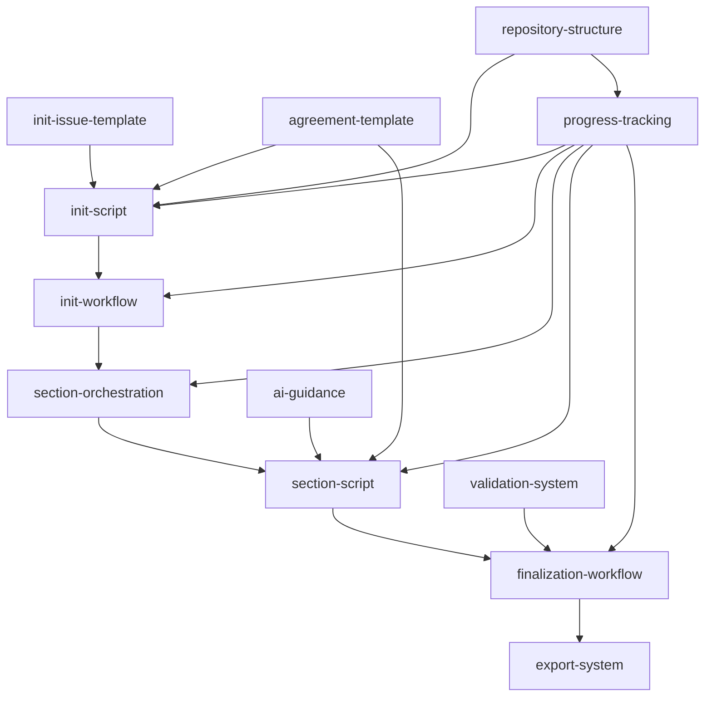
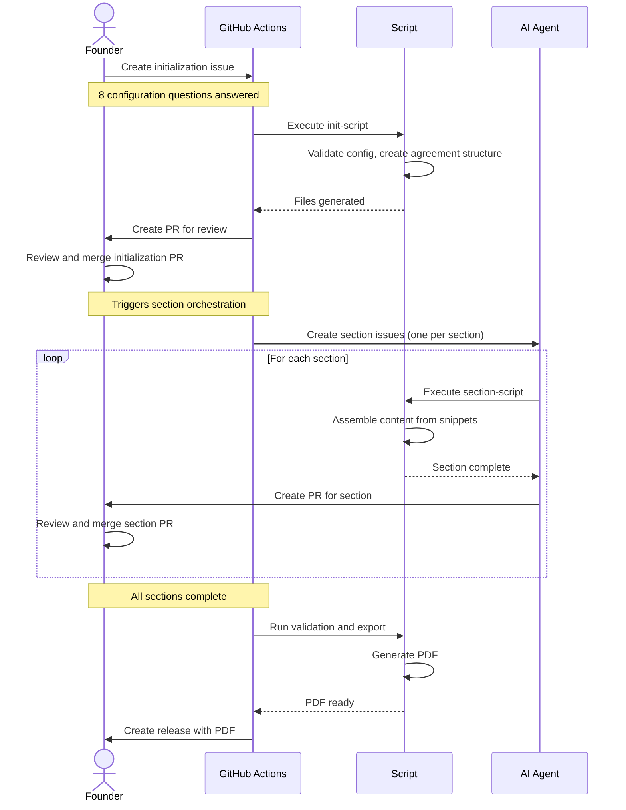

# Blueprint: Catalyst Founders Agreement

## Description

This blueprint defines the complete feature roadmap for the Catalyst Founders Agreement product—a GitHub template repository that automates the creation of structured founders agreements through AI-assisted, version-controlled collaboration.

The product transforms complex legal document creation into a guided, collaborative workflow where founders answer configuration questions, AI generates contextually appropriate content, and founders iteratively refine sections until consensus is reached. The final output is a professional PDF.

## Core Entities

**Configuration Profile**
- Startup type, funding intent, contribution balance, time commitment
- Equity flexibility, studio involvement, open source focus, investment avoidance, team size
- Stored as structured JSON, drives all downstream content generation

**Agreement Document**
- Markdown-based structured document with discrete sections
- Version-controlled with full audit trail
- Exports to PDF for legal review

**Content Snippet**
- Predefined content blocks for specific configuration combinations
- Organized by section and option
- Enables deterministic, repeatable agreement generation

**Section**
- Individual agreement component (equity split, vesting, IP assignment, governance, etc.)
- Completed independently via dedicated issue/PR workflow
- Tracks completion status

**Issue Template**
- Structured form for initialization and section completion
- Contains explicit instructions for AI execution
- Includes validation requirements

**GitHub Workflow**
- Event-driven automation for initialization, orchestration, finalization
- Triggered by issue creation, file updates, section completion
- Orchestrates multi-step processes

## Feature Dependency Graph

## Workflow Sequence Diagram

This diagram shows the high-level workflow layers and actors:

## Features

### Tier 0: Foundation (No Dependencies)

#### Feature 1: repository-structure
**ID**: `repository-structure`
**Dependencies**: None
**Complexity**: Medium
**Priority**: 1

**Scope**: Define and create base configuration files, GitHub repository settings, and labels required by all other features. Folders are created by features that own the files within them.

**Deliverables**:

1. **Base Configuration Files**:
   - `package.json` - Node.js project configuration with dependencies
   - `tsconfig.json` - TypeScript configuration
   - `jest.config.js` - Test configuration
   - `.gitignore` - Git ignore rules
   - `README.md` - Repository overview

2. **GitHub Repository Configuration**:
   - Enable template repository flag
   - Configure branch protection for main branch
   - Set up required status checks

3. **GitHub Labels**:
   - Create labels for issue categorization and workflow automation
   - Labels will support section tracking and status management

#### Feature 2: init-issue-template
**ID**: `init-issue-template`
**Dependencies**: None
**Complexity**: Medium
**Priority**: 2

**Scope**: Create GitHub issue form template with 8 configuration questions, each with dropdown options and clear descriptions. Template includes explicit instructions for AI on how to process responses and which script to execute.

**Questions** (each with 3 options + "Undecided"):

1. **Funding Intent**: How do you plan to fund the company?
   - Bootstrap - No external funding planned
   - Raise Capital - Plan to raise VC/angel funding
   - Undecided - Haven't decided yet

2. **Contribution Balance**: Are founder contributions expected to be equal or unequal?
   - Equal - All founders contribute equally
   - Weighted - Contributions vary by role/time/capital
   - Undecided - Haven't decided yet

3. **Time Commitment**: Will all founders work full-time?
   - Full-Time - All founders fully committed
   - Mixed - Some full-time, some part-time
   - Undecided - Haven't decided yet

4. **Equity Flexibility**: How flexible should equity splits be over time?
   - Fixed - Equity locked at founding
   - Dynamic - Equity adjusts based on contribution
   - Undecided - Haven't decided yet

5. **Studio Involvement**: Is a studio or parent company involved?
   - Yes - Studio/parent company involved
   - No - Independent startup
   - Undecided - Haven't decided yet

6. **Open Source Focus**: Will the product be open source?
   - Yes - Core product will be open source
   - No - Proprietary/closed source
   - Undecided - Haven't decided yet

7. **Investment Avoidance**: Do you want to avoid traditional VC investment?
   - Yes - Avoiding VC, alternative funding
   - No - Open to VC investment
   - Undecided - Haven't decided yet

8. **Team Size**: How many founders are there?
   - 2 Founders
   - 3-4 Founders
   - 5+ Founders

**Default Behavior Mapping**: "Undecided" always means no defaults applied - founders must explicitly choose options during refinement.

#### Feature 3: agreement-template
**ID**: `agreement-template`
**Dependencies**: None
**Complexity**: Large
**Priority**: 3

**Scope**: Complete agreement template system including markdown document structure, configuration guide documentation, content snippets for all option combinations, and section-specific issue templates for AI-driven completion.

**Deliverables**:

1. **Agreement Template** (`templates/agreement-template.md`):
   - Document header with metadata placeholders
   - Introduction section with purpose statement
   - 8 core section placeholders (equity, vesting, IP, governance, roles, capital, exit, dispute)
   - Signature blocks and footer

2. **Configuration Guide Documentation** (`docs/configure.md`):
   - Overview of founders agreements
   - Detailed explanation of each of 8 configuration questions
   - When to choose each option and implications of each choice
   - How options interact with each other
   - Common scenarios and recommended configurations
   - Glossary of legal and startup terms

3. **Content Snippets** (`.xe/snippets/{section}/{option}.md`):
   - Equity split models (equal, weighted, dynamic)
   - Vesting schedules (standard, custom, none)
   - IP assignment clauses
   - Governance structures (simple majority, board-based, role-weighted)
   - Capital contribution terms
   - Exit and buyout provisions
   - Non-compete and non-solicitation clauses
   - Dispute resolution mechanisms
   - Coverage for all meaningful combinations of 8 configuration questions

4. **Section Issue Templates** (`.github/ISSUE_TEMPLATE/sections/`):
   - One template per agreement section (8 templates)
   - Section context and configuration references
   - Explicit script execution instructions for AI
   - Validation requirements and acceptance criteria

**Usage**: Template is instantiated by init-script and populated by section-script with content from snippets based on startup configuration.

---

### Tier 1: Core Configuration (Depends on Tier 0)

#### Feature 4: init-script
**ID**: `init-script`
**Dependencies**: `repository-structure`, `init-issue-template`, `agreement-template`, `progress-tracking`
**Complexity**: Large
**Priority**: 4

**Scope**: TypeScript script with embedded JSON schema that processes initialization issue responses, validates inputs, generates base agreement structure from template, initializes progress tracking, saves configuration, and updates CODEOWNERS file.

**Key Requirements**:
- Define embedded JSON schema for configuration file (8 questions, founder info, metadata)
- Parse issue body and extract question responses
- Validate responses against schema
- Instantiate `founders-agreement.md` from agreement-template with section placeholders
- Call progress-tracking API to create initial `progress.md` with section checklist
- Save validated configuration
- Update `.github/CODEOWNERS` with founder information
- Create summary comment on initialization issue

**Configuration File**: Naming options to consider - `startup-settings.json`, `founder-settings.json`, `agreement-settings.json`, `agreement.json`, or `agreement.config`

#### Feature 5: progress-tracking
**ID**: `progress-tracking`
**Dependencies**: `repository-structure`
**Complexity**: Small
**Priority**: 5

**Scope**: Utility library for creating and updating `progress.md` with visual progress indicators showing which sections are complete, in progress, or not started. Consumed by init-script, section-script, and finalization-workflow.

**API Functions**:
- `createProgressFile(sections[])` - Initialize progress.md with section checklist
- `updateSectionStatus(sectionId, status)` - Mark section as complete/in-progress
- `getCompletionPercentage()` - Calculate overall progress
- `isComplete()` - Check if all sections are done
- `getSectionStatus(sectionId)` - Get current status of a section

**Display Format**:
- Section checklist with status icons
- Percentage complete indicator
- Last updated timestamp
- Link to related issue/PR for each section
- Overall agreement status

---

### Tier 2: Automation (Depends on Tier 1)

#### Feature 6: init-workflow
**ID**: `init-workflow`
**Dependencies**: `init-script`, `progress-tracking`
**Complexity**: Large
**Priority**: 6

**Scope**: GitHub Action workflow that triggers when initialization issue is created/updated, executes init-script, and orchestrates the initialization process.

**Triggers**:
- Issue created with `init-agreement` template
- Issue updated with label `ready-for-processing`

**Steps**:
1. Validate issue has required label and assignments
2. Install dependencies (npm install)
3. Execute init-script with issue data
4. Commit generated files to new branch
5. Create PR for founder review
6. Post summary comment with next steps
7. Close initialization issue when PR merged

#### Feature 7: section-orchestration
**ID**: `section-orchestration`
**Dependencies**: `init-workflow`, `agreement-template`, `progress-tracking`
**Complexity**: Large
**Priority**: 7

**Scope**: GitHub Action workflow that detects when `founders-agreement.md` is created (post-initialization) and automatically creates section-specific issues for each agreement section using templates from agreement-template feature, assigning them to AI.

**Functionality**:
- Read agreement structure and identify sections
- For each incomplete section, create issue from section template
- Assign issue to configured AI agent (e.g., copilot-swe-agent, Claude Code)
- Add section context and configuration from settings file
- Include explicit instructions for which script to run
- Track created issues in `progress.md`

---

### Tier 3: Section Processing (Depends on Tier 2)

#### Feature 8: section-script
**ID**: `section-script`
**Dependencies**: `agreement-template`, `section-orchestration`, `progress-tracking`
**Complexity**: Large
**Priority**: 8

**Scope**: TypeScript script that reads configuration, selects appropriate snippets from agreement-template, assembles section content, and updates `founders-agreement.md` with the completed section.

**Functionality**:
- Read section ID from script arguments
- Load configuration from settings file
- Determine which snippets to use based on configuration
- Assemble section content from snippets
- Insert section content into correct location in agreement
- Update progress.md to mark section complete
- Generate PR with section changes
- Validate section completeness

**Selection Logic**:
- Map configuration profile to snippet paths
- Handle "Undecided" options (use neutral/placeholder content)
- Merge multiple snippets when required
- Apply variable substitution (founder names, dates, etc.)

#### Feature 9: ai-guidance
**ID**: `ai-guidance`
**Dependencies**: `agreement-template`
**Complexity**: Small
**Priority**: 9

**Scope**: AI instruction files that guide collaborative behavior, tone, and approach when answering founder questions about agreement options.

**Requirements**:
1. Generate minimal content in agent-specific instruction files (use Claude Code and GitHub Copilot as examples)
2. Require that common instructions are centralized in a shared file to avoid duplication across agent-specific files

**Instruction Areas**:
- How to interpret founder questions
- When to reference configuration guide documentation
- Tone and style (collaborative, educational, non-legal-advice disclaimer)
- How to explain tradeoffs between options
- When to suggest alternatives
- How to handle ambiguous requests

#### Feature 10: validation-system
**ID**: `validation-system`
**Dependencies**: `init-script`, `section-script`
**Complexity**: Large
**Priority**: 10

**Scope**: TypeScript validation utilities that check agreement completeness, section consistency, configuration validity, and readiness for finalization.

**Validation Rules**:
- All required sections present and non-empty
- Founder information complete and consistent
- Configuration profile matches applied content
- No placeholder text remaining
- Cross-references between sections valid
- Markdown formatting correct
- All progress.md items marked complete

**Validation Triggers**:
- After each section update (section-level validation)
- Before finalization (full agreement validation)
- On-demand via script execution

---

### Tier 4: Finalization (Depends on Tier 3)

#### Feature 11: finalization-workflow
**ID**: `finalization-workflow`
**Dependencies**: `validation-system`, `section-script`, `progress-tracking`
**Complexity**: Large
**Priority**: 11

**Scope**: GitHub Action workflow that triggers when all sections are complete, runs final validation, executes export-system, creates GitHub release with ISO date version, and attaches PDF.

**Triggers**:
- All items in progress.md marked complete
- Manual workflow dispatch with "finalize" label

**Steps**:
1. Run full agreement validation
2. Execute export-system to generate PDF
3. Create git tag with ISO date (yyyy-MM-dd)
4. Create GitHub release with tag
5. Attach PDF to release as artifact
6. Update README with release link
7. Post completion notification comment
8. Archive all section issues
9. Clean up temporary files

#### Feature 12: export-system
**ID**: `export-system`
**Dependencies**: `finalization-workflow`, `validation-system`
**Complexity**: Large
**Priority**: 12

**Scope**: TypeScript script that converts `founders-agreement.md` to professional PDF format with proper styling, formatting, and legal document conventions.

**Functionality**:
- Read and parse markdown agreement
- Apply professional document styling
- Generate table of contents
- Add headers/footers with founder names and date
- Format sections with proper legal numbering
- Embed metadata (version, creation date, founders)
- Output PDF
- Validate PDF generation success

**Technical Approach**:
- Use markdown-to-pdf library (e.g., markdown-pdf, puppeteer)
- Custom CSS for legal document formatting
- Ensure reproducible, deterministic output

---

## Success Criteria

- [ ] Blueprint defines all features needed to implement the Catalyst Founders Agreement product
- [ ] Feature dependency graph is acyclic
- [ ] Dependencies enable parallel implementation within tiers
- [ ] Each feature has clear scope and deliverables
- [ ] Blueprint aligns with product vision
