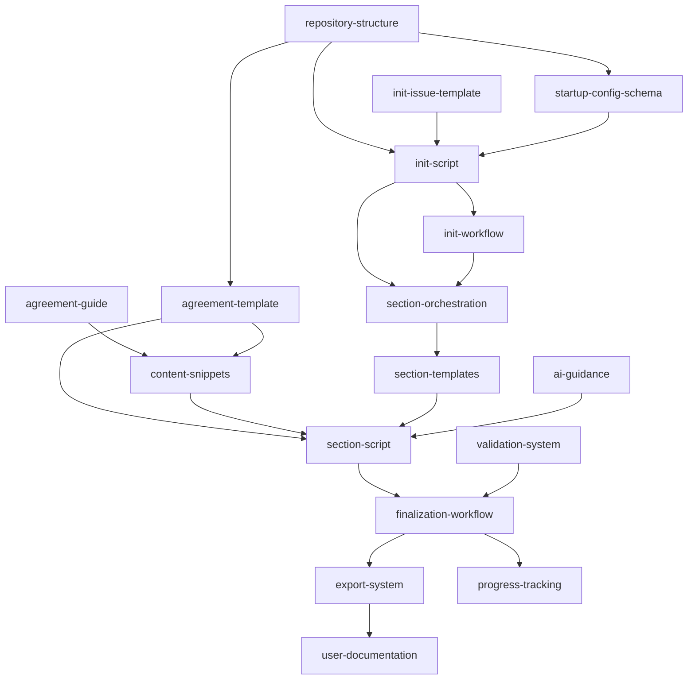

# Blueprint: Catalyst Founders Agreement

## Description

This blueprint defines the complete feature roadmap for the Catalyst Founders Agreement product—a GitHub template repository that automates the creation of structured founders agreements through AI-assisted, version-controlled collaboration.

The product transforms complex legal document creation into a guided, collaborative workflow where founders answer configuration questions, AI generates contextually appropriate content, and founders iteratively refine sections until consensus is reached. The final output is a professional PDF released with ISO-dated versioning.

**Total Features**: 17 features across 5 dependency tiers

## Core Entities

**Configuration Profile**
- Startup type, funding intent, contribution balance, time commitment
- Equity flexibility, studio involvement, open source focus, investment avoidance, team size
- Stored as structured JSON, drives all downstream content generation

**Agreement Document**
- Markdown-based structured document with discrete sections
- Version-controlled with full audit trail
- Exports to PDF for legal review

**Content Snippet**
- Predefined content blocks for specific configuration combinations
- Organized by section and option
- Enables deterministic, repeatable agreement generation

**Section**
- Individual agreement component (equity split, vesting, IP assignment, governance, etc.)
- Completed independently via dedicated issue/PR workflow
- Tracks completion status

**Issue Template**
- Structured form for initialization and section completion
- Contains explicit instructions for AI execution
- Includes validation requirements

**GitHub Workflow**
- Event-driven automation for initialization, orchestration, finalization
- Triggered by issue creation, file updates, section completion
- Orchestrates multi-step processes

## Feature Dependency Graph

## Features

### Tier 0: Foundation (No Dependencies)

#### Feature 1: repository-structure
**ID**: `repository-structure`
**Dependencies**: None
**Complexity**: Small
**Priority**: 1

**Scope**: Define and create the complete directory structure, base configuration files, and foundational files required by all other features.

**Deliverables**:
- `.xe/config/` directory for configuration schemas and settings
- `.xe/snippets/` directory structure for content templates
- `.xe/scripts/` directory for TypeScript automation
- `docs/` directory for end-user documentation
- `.github/workflows/` for GitHub Actions
- `.github/ISSUE_TEMPLATE/` for issue forms
- Root files: `founders-agreement.md`, `progress.md`, `package.json`, `README.md`
- TypeScript/Jest configuration files

#### Feature 2: init-issue-template
**ID**: `init-issue-template`
**Dependencies**: None
**Complexity**: Medium
**Priority**: 2

**Scope**: Create GitHub issue form template with 8 configuration questions, each with dropdown options and clear descriptions. Template includes explicit instructions for AI on how to process responses and which script to execute.

**Questions**:
1. Funding Intent (3 options)
2. Contribution Balance (3 options)
3. Time Commitment (3 options)
4. Equity Flexibility (3 options)
5. Studio Involvement (3 options)
6. Open Source Focus (3 options)
7. Investment Avoidance (3 options)
8. Team Size (3 options)

Each option includes explicit default behavior mapping. "Undecided" always means no default applied.

#### Feature 3: agreement-guide
**ID**: `agreement-guide`
**Dependencies**: None
**Complexity**: Medium
**Priority**: 3

**Scope**: Comprehensive documentation in `docs/` that explains each configuration question, all available options, the implications of each choice, and how they affect the generated agreement. Used by founders during initialization and by AI when answering questions.

**Content Areas**:
- Overview of founders agreements
- Detailed explanation of each of 8 configuration questions
- When to choose each option
- How options interact with each other
- Common scenarios and recommended configurations
- Glossary of legal and startup terms

---

### Tier 1: Core Configuration (Depends on Tier 0)

#### Feature 4: startup-config-schema
**ID**: `startup-config-schema`
**Dependencies**: `repository-structure`
**Complexity**: Small
**Priority**: 4

**Scope**: JSON schema definition for `.xe/config/startup-settings.json` that validates and stores the startup configuration selected during initialization. Schema defines structure for 8 questions, founder information, and metadata.

**Schema Elements**:
- Configuration responses (8 questions with selected options)
- Founder details (names, emails, roles)
- Repository metadata (creation date, template version)
- Validation rules for all fields

**Note**: This schema is specific to startup configuration. The repository may have other settings files for different purposes (e.g., AI configurations, workflow settings), but this schema only covers the startup initialization configuration.

#### Feature 5: init-script
**ID**: `init-script`
**Dependencies**: `repository-structure`, `init-issue-template`, `startup-config-schema`
**Complexity**: Large
**Priority**: 5

**Scope**: TypeScript script that processes initialization issue responses, validates inputs, generates base agreement structure from template, saves configuration to startup-settings.json, and updates CODEOWNERS file.

**Functionality**:
- Parse issue body and extract question responses
- Validate responses against startup-config-schema
- Apply default behaviors based on configuration profile
- Instantiate `founders-agreement.md` from agreement-template with section placeholders
- Save configuration to `.xe/config/startup-settings.json`
- Update `.github/CODEOWNERS` with founder information
- Generate `progress.md` with section completion tracking
- Create summary comment on initialization issue

#### Feature 6: agreement-template
**ID**: `agreement-template`
**Dependencies**: `repository-structure`
**Complexity**: Medium
**Priority**: 6

**Scope**: Markdown template file defining the structure of the founders agreement document with placeholders for sections, founder names, dates, and configuration-driven content.

**Template Structure**:
- Document header with title and metadata placeholders
- Introduction section with purpose statement
- Placeholders for 8 core agreement sections:
  - Equity split and ownership
  - Vesting schedules and acceleration
  - IP assignment and licensing
  - Governance and decision-making
  - Roles and responsibilities
  - Capital contributions
  - Exit provisions and buyouts
  - Dispute resolution
- Signature blocks with founder name placeholders
- Document footer with version and date placeholders

**Usage**: This template is instantiated by init-script and populated by section-script with content from content-snippets based on startup configuration.

#### Feature 7: content-snippets
**ID**: `content-snippets`
**Dependencies**: `agreement-guide`, `agreement-template`
**Complexity**: Medium
**Priority**: 7

**Scope**: Predefined markdown content snippets organized by section and configuration option in `.xe/snippets/{section}/{option}.md`. Each snippet contains legally-informed content appropriate for specific configuration combinations that populate the agreement-template sections.

**Snippet Categories** (aligned with agreement-template sections):
- Equity split models (equal, weighted, dynamic)
- Vesting schedules (standard, custom, none)
- IP assignment clauses
- Governance structures (simple majority, board-based, role-weighted)
- Capital contribution terms
- Exit and buyout provisions
- Non-compete and non-solicitation clauses
- Dispute resolution mechanisms

**Coverage**: All meaningful combinations of 8 configuration questions across all agreement sections.

---

### Tier 2: Automation (Depends on Tier 1)

#### Feature 8: init-workflow
**ID**: `init-workflow`
**Dependencies**: `init-script`, `startup-config-schema`
**Complexity**: Large
**Priority**: 8

**Scope**: GitHub Action workflow that triggers when initialization issue is created/updated, executes init-script, and orchestrates the initialization process.

**Triggers**:
- Issue created with `init-agreement` template
- Issue updated with label `ready-for-processing`

**Steps**:
1. Validate issue has required label and assignments
2. Install dependencies (npm install)
3. Execute init-script with issue data
4. Commit generated files to new branch
5. Create PR for founder review
6. Post summary comment with next steps
7. Close initialization issue when PR merged

#### Feature 9: section-orchestration
**ID**: `section-orchestration`
**Dependencies**: `init-workflow`, `section-templates`
**Complexity**: Large
**Priority**: 9

**Scope**: GitHub Action workflow that detects when `founders-agreement.md` is created (post-initialization) and automatically creates section-specific issues for each agreement section, assigning them to AI.

**Triggers**:
- Creation or update of `founders-agreement.md`
- Detection of incomplete sections in `progress.md`

**Functionality**:
- Read agreement structure and identify sections
- For each incomplete section, create issue from section template
- Assign issue to configured AI agent (e.g., copilot-swe-agent)
- Add section context and configuration from startup-settings.json
- Include explicit instructions for which script to run
- Track created issues in `progress.md`

#### Feature 10: section-templates
**ID**: `section-templates`
**Dependencies**: `repository-structure`, `init-workflow`
**Complexity**: Medium
**Priority**: 10

**Scope**: Dynamic issue templates for each agreement section (equity, vesting, IP, governance, etc.) with targeted instructions for AI on how to complete the section using the section-script.

**Template Structure**:
- Section name and description
- Required configuration context
- Explicit script execution instructions
- Validation requirements
- Expected output format
- Acceptance criteria for completion

**Sections**:
- Equity Split
- Vesting Schedules
- IP Assignment
- Governance Structure
- Capital Contributions
- Roles & Responsibilities
- Exit Provisions
- Dispute Resolution

---

### Tier 3: Section Processing (Depends on Tier 2)

#### Feature 11: section-script
**ID**: `section-script`
**Dependencies**: `content-snippets`, `agreement-template`, `section-orchestration`, `startup-config-schema`
**Complexity**: Large
**Priority**: 11

**Scope**: TypeScript script that reads configuration, selects appropriate snippets, assembles section content, and updates `founders-agreement.md` with the completed section.

**Functionality**:
- Read section ID from script arguments
- Load configuration from startup-settings.json
- Determine which snippets to use based on configuration
- Assemble section content from content-snippets
- Insert section content into correct location in agreement (based on agreement-template structure)
- Update progress.md to mark section complete
- Generate PR with section changes
- Validate section completeness

**Selection Logic**:
- Map configuration profile to snippet paths
- Handle "Undecided" options (use neutral/placeholder content)
- Merge multiple snippets when required
- Apply variable substitution (founder names, dates, etc.)

#### Feature 12: ai-guidance
**ID**: `ai-guidance`
**Dependencies**: `agreement-guide`
**Complexity**: Medium
**Priority**: 12

**Scope**: Tuned instruction files for GitHub Copilot and future AI agents that guide collaborative behavior, tone, and approach when answering founder questions about agreement options.

**Instruction Areas**:
- How to interpret founder questions
- When to reference agreement-guide documentation
- Tone and style (collaborative, educational, non-legal-advice disclaimer)
- How to explain tradeoffs between options
- When to suggest alternatives
- How to handle ambiguous requests
- Disclaimers about not providing legal advice

**File Locations**:
- `.github/copilot-instructions.md`
- Future: `.xe/ai/` directory for agent-specific instructions

#### Feature 13: validation-system
**ID**: `validation-system`
**Dependencies**: `startup-config-schema`, `section-script`
**Complexity**: Large
**Priority**: 13

**Scope**: TypeScript validation utilities that check agreement completeness, section consistency, configuration validity, and readiness for finalization.

**Validation Rules**:
- All required sections present and non-empty
- Founder information complete and consistent
- Configuration profile matches applied content
- No placeholder text remaining
- Cross-references between sections valid
- Markdown formatting correct
- All progress.md items marked complete

**Validation Triggers**:
- After each section update (section-level validation)
- Before finalization (full agreement validation)
- On-demand via script execution

---

### Tier 4: Finalization (Depends on Tier 3)

#### Feature 14: finalization-workflow
**ID**: `finalization-workflow`
**Dependencies**: `validation-system`, `section-script`
**Complexity**: Large
**Priority**: 14

**Scope**: GitHub Action workflow that triggers when all sections are complete, runs final validation, executes export-system, creates GitHub release with ISO date version, and attaches PDF.

**Triggers**:
- All items in progress.md marked complete
- Manual workflow dispatch with "finalize" label

**Steps**:
1. Run full agreement validation
2. Execute export-system to generate PDF
3. Create git tag with ISO date (yyyy-MM-dd)
4. Create GitHub release with tag
5. Attach PDF to release as artifact
6. Update README with release link
7. Post completion notification comment
8. Archive all section issues
9. Clean up temporary files

#### Feature 15: export-system
**ID**: `export-system`
**Dependencies**: `finalization-workflow`, `validation-system`
**Complexity**: Large
**Priority**: 15

**Scope**: TypeScript script that converts `founders-agreement.md` to professional PDF format with proper styling, formatting, and legal document conventions.

**Functionality**:
- Read and parse markdown agreement
- Apply professional document styling
- Generate table of contents
- Add headers/footers with founder names and date
- Format sections with proper legal numbering
- Embed metadata (version, creation date, founders)
- Output PDF to `.xe/output/founders-agreement-{date}.pdf`
- Validate PDF generation success

**Technical Approach**:
- Use markdown-to-pdf library (e.g., markdown-pdf, puppeteer)
- Custom CSS for legal document formatting
- Ensure reproducible, deterministic output

#### Feature 16: progress-tracking
**ID**: `progress-tracking`
**Dependencies**: `section-orchestration`
**Complexity**: Small
**Priority**: 16

**Scope**: Visual progress indicators in `progress.md` that show which sections are complete, in progress, or not started. Updated automatically by workflows and scripts.

**Display Format**:
- Section checklist with status icons
- Percentage complete indicator
- Last updated timestamp
- Link to related issue/PR for each section
- Overall agreement status (Draft, In Review, Complete)

**Updates**:
- Automatically updated by section-script after each section
- Rendered in GitHub's markdown UI with checkboxes
- Consumed by finalization-workflow to determine readiness

#### Feature 17: user-documentation
**ID**: `user-documentation`
**Dependencies**: `export-system`
**Complexity**: Medium
**Priority**: 17

**Scope**: Complete end-user product documentation in `docs/` covering how to use the template, customize agreements, understand workflows, and troubleshoot issues. This is the instructional guide that walks founders through the initialization questions and helps them understand their options.

**Documentation Files**:
- `docs/README.md` - Overview and quick start
- `docs/agreement-guide.md` - Detailed configuration guide (from feature 3)
- `docs/workflow-guide.md` - How the automation works
- `docs/customization-guide.md` - How to customize snippets and templates
- `docs/troubleshooting.md` - Common issues and solutions
- `docs/ai-collaboration.md` - How to work effectively with AI
- `docs/legal-disclaimer.md` - Not legal advice disclaimer
- `docs/faq.md` - Frequently asked questions

---

## Success Criteria

- [ ] All 17 features documented with unique IDs
- [ ] Feature dependency graph is acyclic and correctly represents dependencies
- [ ] Features are organized into 5 dependency tiers
- [ ] Each feature has scope description (1-2 sentences)
- [ ] Each feature has complexity estimate (Small, Medium, Large)
- [ ] Each feature has priority order number
- [ ] All features align with product vision in `.xe/product.md`
- [ ] Blueprint enables implementation of complete Catalyst Founders Agreement product

## Implementation Approach

Features will be implemented using `/catalyst:run start-rollout {feature-id}` for each feature in dependency order. Features within the same tier can be implemented in parallel if multiple developers are available.

**Recommended Implementation Order**:
1. Tier 0 features (parallel): repository-structure, init-issue-template, agreement-guide
2. Tier 1 features (sequential): startup-config-schema → init-script and agreement-template → content-snippets
3. Tier 2 features (sequential): init-workflow → section-orchestration → section-templates
4. Tier 3 features (parallel): section-script, ai-guidance, validation-system
5. Tier 4 features (sequential): finalization-workflow → export-system → progress-tracking → user-documentation

Total estimated timeline: 12-18 weeks with 1 full-time developer, 6-9 weeks with 2 developers working in parallel on independent tiers.
